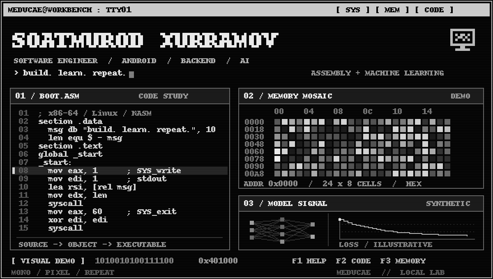
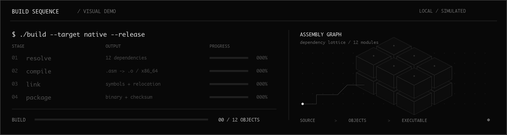

<!-- Profile: meducae/meducae | Keep the assets folder beside this file. -->

<p align="center">
  
</p>

<p align="center">
  <a href="https://github.com/meducae?tab=repositories"></a>
  &nbsp;
  <a href="https://t.me/meducae"></a>
  &nbsp;
  <a href="https://www.linkedin.com/in/soatmurod-xurramov-7ba9b03a4/"></a>
</p>

### `$ whoami`

I'm **Soatmurod Xurramov**, a software engineer working across Android, cross-platform applications and backend systems. I care about clear architecture, efficient code and the details that make software reliable.

```yaml
focus:
  - AI integrations
  - Machine learning
  - Kotlin Multiplatform
exploring:
  - Assembly & computer systems
principles:
  - SOLID & modular architecture
  - Fast responses & low memory use
```

### `$ ls ~/stack`

| Workspace | Technologies |
| :--- | :--- |
| **Mobile** | Kotlin · Dart · Flutter · Kotlin Multiplatform |
| **Backend** | Python · FastAPI · PHP |
| **Data & infrastructure** | MySQL · Docker · Linux · AWS |
| **Version control** | Git · GitHub |

### `$ cat ~/lab/model.py`

From CPU instructions to model inference — I like understanding what happens beneath the abstraction.

```python
# lab/model.py · affine + ReLU
import numpy as np

def forward(x, weights, bias):
    z = x @ weights + bias
    return np.maximum(0, z)  # ReLU
```

<details>
<summary><strong>Open boot.asm</strong> — the program in the banner</summary>

```asm
; Linux x86-64 · NASM syntax
section .data
    msg db "build. learn. repeat.", 10
    len equ $ - msg

section .text
global _start

_start:
    mov eax, 1
    mov edi, 1
    lea rsi, [rel msg]
    mov edx, len
    syscall

    mov eax, 60
    xor edi, edi
    syscall
```

The banner's mosaic, memory addresses and signal graphics are a visual study of computation.

</details>

### `$ make build`

<p align="center">
  
</p>

- **Architecture:** clear boundaries, focused modules and explicit dependencies.
- **Performance:** measure response time, memory use and the cost of abstractions.
- **Delivery:** build, test, observe and improve.

---

<p align="center">
  <samp>build. learn. repeat.</samp><br />
  <a href="https://t.me/meducae">Telegram</a> ·
  <a href="https://www.linkedin.com/in/soatmurod-xurramov-7ba9b03a4/">LinkedIn</a> ·
  <a href="https://github.com/meducae?tab=repositories">Explore the code</a>
</p>
